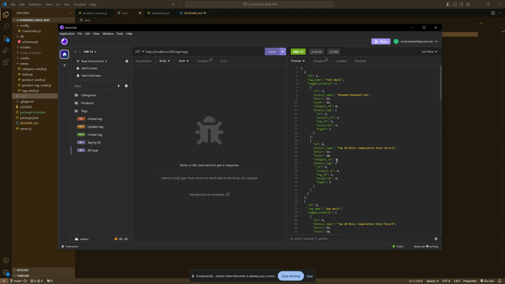

# E-commerce-Back-End

## Description
    
This is an E-commerce back end contructed with Express.js API and configured to use Sequelize to interact with a MySQL database. Users can use an API testing program such as Insomnia to send GET, POST, PUT, and DELETE requests to the server to view and manipulate the data of this internet retail mock-up.

Internet retail, also known as e-commerce, plays a significant role within the electronics industry, as it empowers businesses and consumers alike to conveniently engage in online buying and selling of electronic products. It is essential for any business wishing to expand to an online platform to have a functioning back-end to keep track of their stock. This application demonstrates how such a back end would work and how to make requests to the server to adjust the stock as needed.

In creating the routes for this application, I was able to become more familiar with how GET, POST, PUT, and DELETE requests function. Also, creating the models for the database helped me better understand how data is transferred and stored through Sequelize.
    
## Table of Contents
    
- [Installation](#installation)
- [Usage](#usage)
- [Video](#video)
- [Contributing](#contributing)
- [License](#license)
- [Tests](#tests)
- [Questions](#questions)
    
## Installation
    
Install the latest version of NodeJS, MySQL, and Insomnia.
Download this repo onto your local computer.
Navigate to the file directory in your terminal and run "npm i" to install the necessary packages.
    
## Usage

After following the installation instructions above:
Create a .env file and define your "DB_NAME", "DB_USER", and "DB_PW" to establish the connection to your database.
Navigate to the db folder in your terminal and run "mysql -u 'username' -p" to log in to the SQL shell. Then run "SOURCE schema.sql" to create the e-commerce database.
Return to the root of the file directory in your terminal and run "node seeds/index.js" to add the data to your database.
Run the command "npm start" to start the server.
Open Insomnia and set up the routes as seen in the video demonstration, linked below. Refer to the notes in the code or the video demonstration to see how to format the JSON data for the POST and PUT requests.
Send the GET, POST, PUT, and DELETE requests to view and manipulate the data in the database.

### Video

Click the following image to watch a video demonstrating the functionality of the GET, POST, PUT, and DELETE routes.

    
## Contributing

- Contributors: [eaeidsath](github.com/eaeidsath), [Xandromus](https://github.com/Xandromus), [Georgeyoo](https://github.com/Georgeyoo), [rxtATX](https://github.com/rxtATX)
- Credits: The format of routes in the routes JS files was referenced from class materials.
- Contribution instructions: This project is not seeking contributors at this time.
    
## License

The following license is being used for this project: MIT License.
    
## Tests

N/A

## Questions

Please direct questions to [eaeidsath](github.com/eaeidsath) or email your questions to evelyneidsath@gmail.com.
